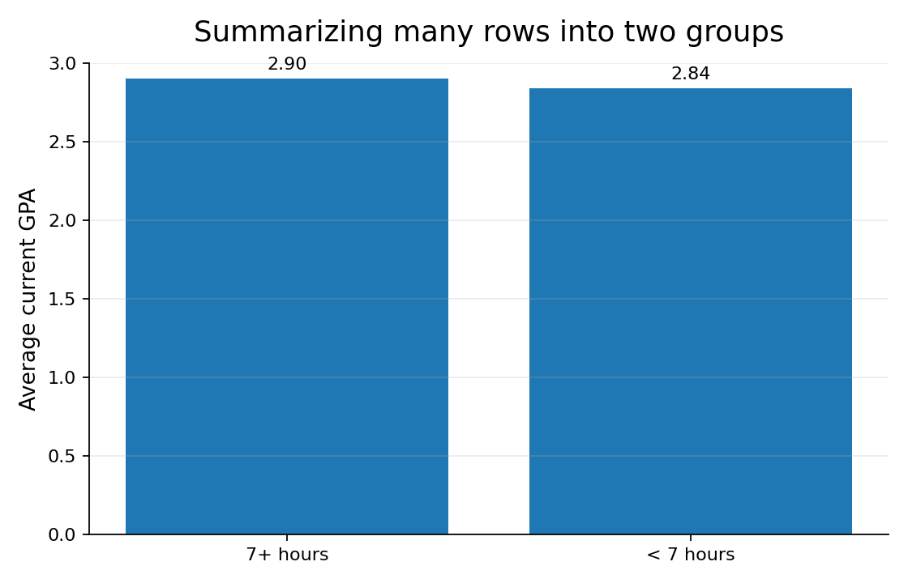
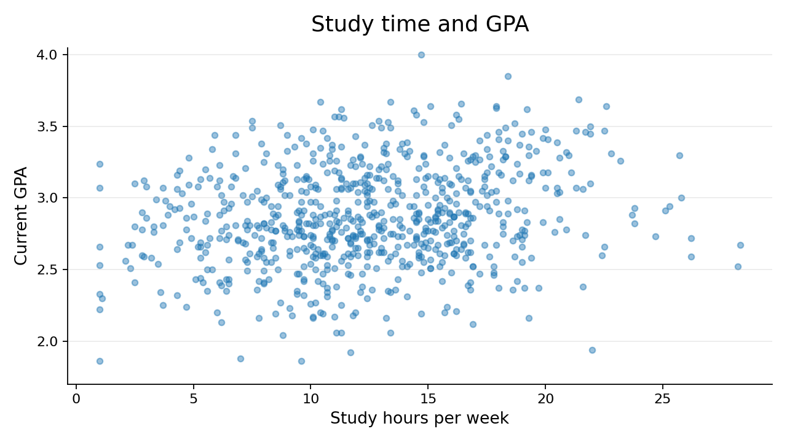
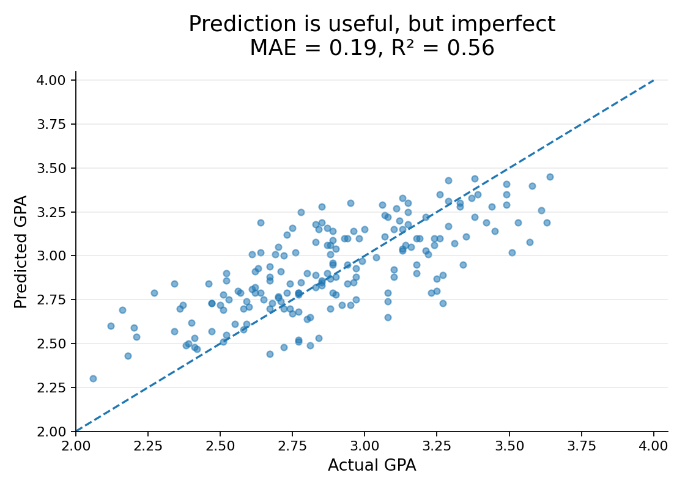

## Where we left off {.question-slide}

::: {.prompt}
**What do you remember from Day 1?**
:::

::: {.supporting}
Take thirty seconds and jot down one or two ideas before we look back together.
:::

::: {.incremental}
- Data science uses data to **understand, explain, predict, and make decisions** about the world.
- It is an **iterative process**: ask, prepare, explore, model, communicate, decide.
- It is a **broad field**, so the natural follow-up to "I'm interested in data science" is **"What part?"**
:::

::: {.supporting .fragment}
Today we will experience that work firsthand: one question, one dataset, from observations to answers.
:::

::: {.notes}
Keep this to two or three minutes. Let students retrieve from memory first, then reveal the three reminders. If the Day 1 exit tickets surfaced a common misconception, address it here. The final line previews the arc of today's deck.
:::

## Today's question {.takeaway-slide .hide-title .center-vert}

::: {.r-fit-text}
**What helps a college student succeed?**
:::

::: {.big-idea .fragment}
To answer that, we first need to decide what to observe.
:::

::: {.notes}
This slide turns the whole day into a single investigation. Keep the framing short and let the next slide become the real student interaction.
:::

## What do we mean by success? {.question-slide}

::: {.prompt}
**Before we collect data, we have to define the outcome we care about.**
:::

::::: {.three-up}
:::: {.ds-card .fragment}
**Academic progress**

GPA, credits completed, persistence, graduation
::::

:::: {.ds-card .fragment}
**Life after college**

Placement, graduate school, salary, career fit
::::

:::: {.ds-card .fragment}
**Human flourishing**

Happiness, belonging, purpose, health, family life
::::
:::::

::: {.key-idea .fragment}
How we define success shapes what data we collect and what answers we can give.
:::

::: {.notes}
This is a quick but important pause. The goal is not to settle the true definition of student success. The goal is to help students see that data science starts with a human choice about what counts as the outcome.
:::

## Today, GPA is our proxy {.takeaway-slide}

::: {.big-idea}
For today's exercise, we will use **current GPA** as a measurable stand-in for academic success.
:::

::: {.statement .fragment}
A **proxy** is useful when the thing we care about is broad, complicated, or hard to measure directly.
:::

::: {.supporting .fragment}
But a proxy is not the same as the full idea. GPA is one piece of student success, not the whole picture.
:::

::: {.notes}
Use this slide to avoid implying that GPA equals student success. It is a convenient outcome for today's synthetic dataset because students recognize it and it can be modeled numerically. Emphasize that different definitions of success would require different data, different summaries, and possibly different models.
:::

## What would you want to know? {.question-slide}

::: {.prompt}
**What would you want to know about a student if GPA were our proxy for academic success?**
:::

::: {.supporting .fragment}
**Think:** brainstorm on your own for a minute. Picture one student you know: what would you measure?
:::

::: {.supporting .fragment}
**Pair:** compare lists with a neighbor. What did they think of that you did not?
:::

::: {.supporting .fragment}
**Share:** we will gather ideas from around the room.
:::

::: {.notes}
Run this as a genuine think-pair-share: about one minute to think, two to pair, then collect ideas on the board before advancing. Do not screen suggestions for practicality yet. The point is that variables should arise from questions, not from spreadsheets.
:::

## What would you measure?

::::: {.three-up}
:::: {.ds-card .fragment}
**Habits**

Sleep, study time, attendance, exercise, phone use
::::

:::: {.ds-card .fragment}
**Context**

Work hours, commute, housing, course load
::::

:::: {.ds-card .fragment}
**Background and outcomes**

Previous GPA, year in school, major, current GPA 

*(our proxy outcome today)*
::::
:::::

::: {.supporting .fragment}
You can probably think of variables we missed. That is part of deciding what data to collect.
:::

::: {.notes}
Use this slide to organize what students named, not to replace their ideas. If students name other variables, acknowledge that those could also be useful.
:::

## We anticipated some of your ideas {.demo-slide}



::: {.supporting}
This is a synthetic dataset of 750 fictional students.
:::

::: {.notes}
Tell students explicitly that the data are synthetic. The relationships are designed to be plausible enough for today's conceptual exercise, not to make claims about real BYU students.
:::

## The most important idea today {.takeaway-slide .hide-title .center-vert}

::: {.r-fit-text}
**Every row represents something.**
:::

::: {.big-idea .fragment}
That something is what we use to answer questions.
:::

## One row = one student {.demo-slide}



::: {.prompt .fragment}
What questions can this row answer?
:::

::: {.statement .fragment}
Rows tell us **who or what** we observed. Columns tell us **what we measured**.
:::

::: {.notes}
This combines the original rows/columns explanation with the one-student example. Ask students to name questions this one row can answer before revealing the statement.
:::

## What can one row answer? {.question-slide}

:::: {.compare}
::: {.ds-card .fragment}
**Questions about this student**

How much did this student sleep?

How often did this student attend class?
:::

::: {.ds-card .fragment}
**Questions it cannot answer alone**

How much do students usually sleep?

Do students with higher attendance tend to earn higher GPAs?
:::
::::

::: {.key-idea .fragment}
Individual observations are useful, but many data science questions require many observations.
:::

## What can many rows answer?

```{mermaid}
%%| fig-responsive: false
%%| fig-width: 12
flowchart LR
  A[One student] --> B[Many students]
  B --> C[Summarize]
  C --> D[Answer questions about a group]
```

::: {.statement .fragment}
We can aggregate individual observations to answer group-level questions.
:::

## Summaries answer questions {.demo-slide}



::: {.key-idea}
A summary statistic is useful because it turns many rows into an answer to a question.
:::

::: {.notes}
Do not turn this into a formal lesson on summary statistics. Frame count, mean, median, and proportion as tools that answer different questions about a collection of rows.
:::

## Before we aggregate {.question-slide}

::: {.prompt}
Suppose we group students by class year and calculate average sleep, average study time, and average GPA.
:::

::: {.big-idea .fragment}
What would one row represent now?
:::

::: {.notes}
This slide makes the aggregation transition participatory. Let students answer before showing the aggregated table. The goal is for them to discover that row meaning can change.
:::

## Aggregating changes what a row represents {.demo-slide}



::: {.statement .fragment}
Raw data: one row = **student**.  
Summary: one row = **class year**.
:::

## Same original data, different questions

:::: {.compare}
::: {.ds-card}
**Student-level rows**

Who seems likely to earn a higher GPA?
:::

::: {.ds-card}
**Group-level rows**

How do class years compare on average?
:::
::::

::: {.key-idea .fragment}
Changing the unit represented by a row changes the questions the data can answer.
:::

## What does one row represent? {.question-slide}

| Dataset | What might one row represent? |
|---|---|
| Student success survey | ? |
| Course grade records | ? |
| Student sleep diary | ? |
| Campus dining transactions | ? |

::: {.notes}
Possible answers: student, student-course enrollment, student-day, transaction. For the course grade example, use the ambiguity to make the point that we must know how the dataset was constructed.
:::

## A dataset does not know everything {.takeaway-slide .hide-title .center-vert}

::: {.r-fit-text}
**What one row represents determines what the dataset knows.**
:::

## But which rows did we observe? {.question-slide}

::: {.prompt}
Suppose our dataset has **750 students**. What does that let us say?
:::

::: {.supporting .fragment}
The answer depends on where those 750 students came from.
:::

## Same 750 rows, different situations

::::: {.three-up}
:::: {.ds-card .fragment}
**Situation 1**

These are **all** students in a particular course this semester.
::::

:::: {.ds-card .fragment}
**Situation 2**

These are a **random sample** of BYU students.
::::

:::: {.ds-card .fragment}
**Situation 3**

These are students who chose to answer a link posted on Instagram.
::::
:::::

::: {.statement .fragment}
Same number of rows. Very different claims.
:::

## Describe the rows or generalize beyond them?

:::: {.compare}
::: {.ds-card .fragment}
**Descriptive claim**

Among these 750 students, average sleep was 6.7 hours.
:::

::: {.ds-card .fragment}
**General claim**

BYU students average 6.7 hours of sleep.
:::
::::

::: {.key-idea .fragment}
Describing the rows is different from making a claim about a larger population.
:::

::: {.notes}
This slide sharpens the sample/population distinction. The first claim is about the observed rows. The second requires assumptions about how the 750 students relate to BYU students more broadly.
:::

## Sample and population

```{mermaid}
%%| fig-responsive: false
%%| fig-width: 10
flowchart TD
  Q[Question we want to answer] --> P[Population we care about]
  P --> S[Sample we actually observe]
  S --> D[Rows in our dataset]
  D --> C[Claims we can responsibly make]
```

::: {.key-idea .fragment}
Lots of rows do not automatically support broad claims.
:::

## Which claim is justified? {.question-slide}



::: {.notes}
Have students vote. The first claim is directly descriptive of the rows observed. Broader claims require assumptions about how the sample relates to the population.
:::

## The same logic applies to prediction {.question-slide}

::: {.statement}
Later today we will use patterns in these rows to **predict an individual student's GPA**.
:::

::: {.incremental}
- For another student similar to the students in our data? More reasonable.
- For a new BYU student? It depends on how well our 750 represent BYU students.
- For college students anywhere? Now we are going far beyond our rows.
:::

::: {.key-idea .fragment}
A prediction is usually most trustworthy for new observations that resemble the data used to build the model.
:::

::: {.notes}
This extends the previous vote from describing to predicting before any model appears. Use this to start building intuition for generalization without making the statement too absolute.
:::

## We can compare groups too {.demo-slide}



::: {.prompt .fragment}
What does this comparison suggest?
:::

::: {.supporting .fragment}
And what does it **not** prove?
:::

## A first visualization {.demo-slide}

{fig-align="center" width="72%"}

::: {.key-idea .fragment}
A pattern is not automatically an explanation.
:::

::: {.notes}
Use this as the first association versus causation moment. The data may show a difference between groups, but that does not prove sleep caused the difference.
:::

## Another view {.demo-slide}

{fig-align="center" width="78%"}

::: {.prompt .fragment}
If you had to predict GPA for a student who studies 12 hours per week, where would you guess?
:::

::: {.statement .fragment}
There is a pattern, but not a perfect one.
:::

::: {.notes}
This plot should bridge naturally into prediction. Let students reason from the scatterplot before talking about models.
:::

## Three ways to use the same data

::::: {.three-up}
:::: {.ds-card .fragment}
**Describe**

What happened in the rows we observed?
::::

:::: {.ds-card .fragment}
**Compare**

How do groups or variables differ?
::::

:::: {.ds-card .fragment}
**Predict**

What might happen for a new observation?
::::
:::::

::: {.key-idea .fragment}
Prediction uses the same data, but asks a different question.
:::

## Can we predict a new student's GPA? {.question-slide}



::: {.prompt .fragment}
Before seeing a model, what GPA would **you** predict?
:::

::: {.notes}
Give students a moment to make a human prediction. You can collect a few guesses or have everyone write one down.
:::

## A simple predictive model

```{mermaid}
%%| fig-responsive: false
%%| fig-width: 11
flowchart LR
  X[What we know about<br/>a student] --> M[Model]
  M --> Y[Predicted GPA]
```

::: {.statement .fragment}
The model learns a pattern from students we already observed, then applies that pattern to a new student.
:::

## How can several variables become one prediction? {.demo-slide}

\[
\widehat{GPA}=b_0+b_1(Previous\ GPA)+b_2(Study)+b_3(Attendance)+\cdots
\]

::: {.supporting .fragment}
**Mathematics** gives us a way to represent relationships.
:::

::: {.supporting .fragment}
**Statistics** helps us learn those relationships from noisy data.
:::

::: {.supporting .fragment}
**Computing** lets us do this for many rows and many variables.
:::

::: {.prompt .fragment}
Where should the weights ($b_1, b_2, b_3, \ldots$) come from?
:::

::: {.supporting .fragment}
We are not learning regression today. We are noticing that prediction creates several different kinds of problems.
:::

## The model's prediction {.takeaway-slide .hide-title .center-vert}



## Prediction is useful, but imperfect {.demo-slide}

{fig-align="center" width="68%"}

::: {.prompt .fragment}
What would a perfect model look like on this graph?
:::

::: {.supporting .fragment}
Each point is a student the model did not train on. Points away from the diagonal are prediction errors.
:::

## Should we trust it? {.question-slide}

::: {.prompt}
When would this prediction be useful, and when would you be cautious?
:::

:::: {.compare}
::: {.ds-card .fragment}
**Does the model apply?**

A similar student?

A student at a different institution?

A middle-school student?
:::

::: {.ds-card .fragment}
**Should we act on it?**

Giving study advice?

Flagging students for support?

Making a high-stakes decision?
:::
::::

::: {.key-idea .fragment}
Prediction is not certainty, and prediction is not automatically explanation.
:::

## A quick reality check {.demo-slide}

::: {.supporting}
Everything so far used a clean dataset. Real data often look more like this.
:::



::: {.prompt .fragment}
What would make you nervous about summarizing or modeling these rows?
:::

::: {.supporting .fragment}
We will learn how to clean messy data later. For now, notice that useful data rarely arrive perfectly prepared.
:::

::: {.notes}
This moved later so it does not interrupt the row/variable foundation. Keep it brief. The goal is to preview the need for data cleaning, not teach cleaning today.
:::

## Think back over what we just did {.question-slide}

::: {.prompt}
**What kinds of expertise did we need to answer one seemingly simple question?**
:::

::: {.supporting}
Do not name the disciplines yet. Reconstruct them from the problems we encountered.
:::

::: {.notes}
Have students call these out before revealing the next slide. This is the payoff. Write their answers on the board and then map those answers to the disciplines on the following slide.
:::

## What did we need?

::::: {.three-up}
:::: {.ds-card .fragment}
**How should we define success?**

We needed judgment about what outcome matters and what proxy is reasonable.
::::

:::: {.ds-card .fragment}
**How do we handle 750 rows?**

We needed tools for storing, transforming, and computing with data.
::::

:::: {.ds-card .fragment}
**What do the rows let us claim?**

We needed reasoning about samples, variation, and uncertainty.
::::
:::::

::::: {.three-up}
:::: {.ds-card .fragment}
**How do variables combine?**

We needed a mathematical way to express and learn relationships.
::::

:::: {.ds-card .fragment}
**How do we show patterns?**

We needed visualization and communication.
::::

:::: {.ds-card .fragment}
**What should we do with the result?**

We needed context, judgment, and attention to consequences.
::::
:::::

## That is why data science is broad {.takeaway-slide}

```{mermaid}
%%| fig-responsive: false
%%| fig-width: 12
flowchart TD
  Q[Real questions] --> DK[Domain knowledge]
  Q --> CS[Computing]
  Q --> ST[Statistics]
  Q --> MA[Mathematics]
  Q --> CO[Communication]
  Q --> HJ[Human judgment]
  DK --> DS[Data science]
  CS --> DS
  ST --> DS
  MA --> DS
  CO --> DS
  HJ --> DS
```

::: {.big-idea .center}
Data science is interdisciplinary because **real questions create different kinds of problems**.
:::

## Today was the whole course in miniature

```{mermaid}
%%| fig-responsive: false
%%| fig-width: 13
flowchart LR
  Q[Question] --> O[Observe]
  O --> R[Represent]
  R --> S[Summarize]
  S --> G[Generalize]
  G --> P[Predict]
  P --> E[Evaluate]
  E --> C[Communicate]
  C --> D[Decide]
```

::: {.statement .fragment}
We will spend the semester getting better at each part.
:::

::: {.key-idea .fragment}
Different stages create different problems. That is why data science draws on many disciplines.
:::

## Exit question {.question-slide}

::: {.prompt}
For any dataset you encounter, ask:
:::

::: {.big-idea}
**What does one row represent, and what larger group are we trying to learn about?**
:::

::: {.notes}
Have students answer for today's dataset, then ask them to imagine a dataset from a topic they care about and answer again.
:::
